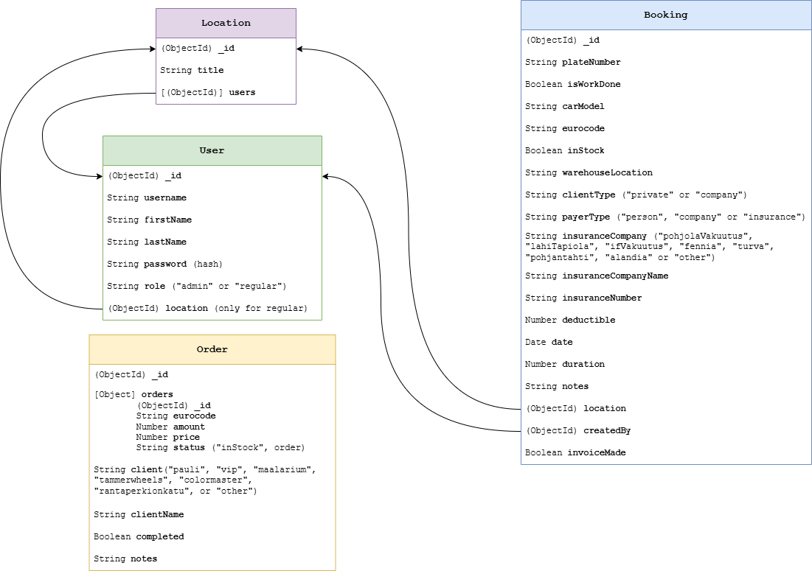

# TuulilasiKalenteri Backend

This is a backend server for the **TuulilasiKalenteri** web application.

## Technologies

- **React**: Component-based UI library.
- **Vite**: Fast development server and build tool.
- **Material-UI**: UI components for a modern design.
- **React Router**: Client-side routing.
- **i18next**: Internationalization and localization.
- **Notistack**: Snackbar notifications.

## Backend Structure

```text
server/
├── controllers/ # API logic
├── models/      # Database schemas
├── routes/      # API routes
├── middlewares/ # Middleware functions
├── config/      # Database configuration
├── .env         # File with environment variables
└── index.js     # Main server file
```

## Setup Instructions

### Prerequisites

- **Node.js** (v16 or higher)
- **npm** (v7 or higher)
- **MongoDB** (local or cloud instance)

### Installation

1. Clone the repository:

   ```bash
   git clone https://github.com/your-repo/TuulilasiPojat.git
   cd TuulilasiPojat
   ```

2. Install dependencies for backend:

   ```bash
   cd server
   npm install
   ```

## Running Backend

To run backend locally for development use

```bash
npm run dev
```

in the `/server` directory. This will add logging output using `morgan`.

To run the backend without logging (e.g. for production), use

```bash
npm run start
```

## Environment Variables

To run the backend, create a `.env` file in the `server/` directory with the following variables:

```
JWT_SECRET = your_jwt_secret
DB_URI = mongodb_connection_string
EMAIL_USER = your_email@example.com
EMAIL_PASS = your_email_password
CLIENT_URL = http://localhost:5173 # Used in emails
```

## API Endpoints

### Bookings

- **GET** `/api/bookings`: Fetch all bookings. Admins get all bookings and regular users get only their own bookings.
- **GE**T `/api/bookings/:id`: Fetch a specific booking by its ID.
- **POST** `/api/bookings`: Create a new booking.
- **PUT** `/api/bookings/:id`: Update a booking.
- **DELETE** `/api/bookings/:id`: Delete a booking.
- **GET** `/api/invoices/`: A shorthand to get bookings for which invoices have been sent or not sent.
- **POST** `/api/invoices/change-invoice-status`: A shorthand to change bookings's status. Requires an array of booking IDs and a `invoiceMade` query parameter.

### Notes

- **GET** `/api/notes`: Fetch all notes.
- **GET** `/api/notes/:id`: Fetch a specific note by its ID.
- **POST** `/api/notes`: Create a new note.
- **PUT** `/api/notes/:id`: Update a note.
- **DELETE** `/api/notes/`:id: Delete a note.

### Authorization

- **POST** `/login`: Log in a user.
- **POST** `/register`: Register a new user (admin only).
- **POST** `/logout`: Log out a user.
- **GET** `/verify-token`: Verify the current user's token. Is used when the website is loaded.
- **POST** `/check-password`: Check if the provided password is correct.
- **POST** `/forgot-password`: Request a password reset. Send an email to reset it.
- **POST** `/verify-reset-token`: Verify the password reset token.
- **POST** `/reset-password`: Reset the user's password.

### Users

- **GET** `/api/users`: Fetch all users.
- **PUT** `/api/users/:id`: Update a user.
- **DELETE** `/api/users/:id`: Delete a user.

### Orders

- **GET** `/api/orders`: Fetch all orders. Supports filtering by completion status using the `completed` query parameter.
- **GET** `/api/orders/:id`: Fetch a specific order by its ID.
- **POST** `/api/orders`: Create a new order.
- **PUT** `/api/orders/:id`: Update an existing order.
- **DELETE** `/api/orders/:id`: Delete an order by its ID.
- **POST** `/api/orders/change-status`: Update the completion status of multiple orders. Requires an array of order IDs and a `completed` query parameter.

### Locations

- **GET** `/api/locations`: Fetch all locations. Admins get all locations, while regular users get only their assigned locations.
- **GET** `/api/locations/:id`: Fetch a specific location by its ID.
- **POST** `/api/locations`: Create a new location (admin only).
- **PUT** `/api/locations/:id`: Update an existing location (admin only).
- **DELETE** `/api/locations/:id`: Delete a location and its associated users and bookings (admin only).

## Data Relation Schema


